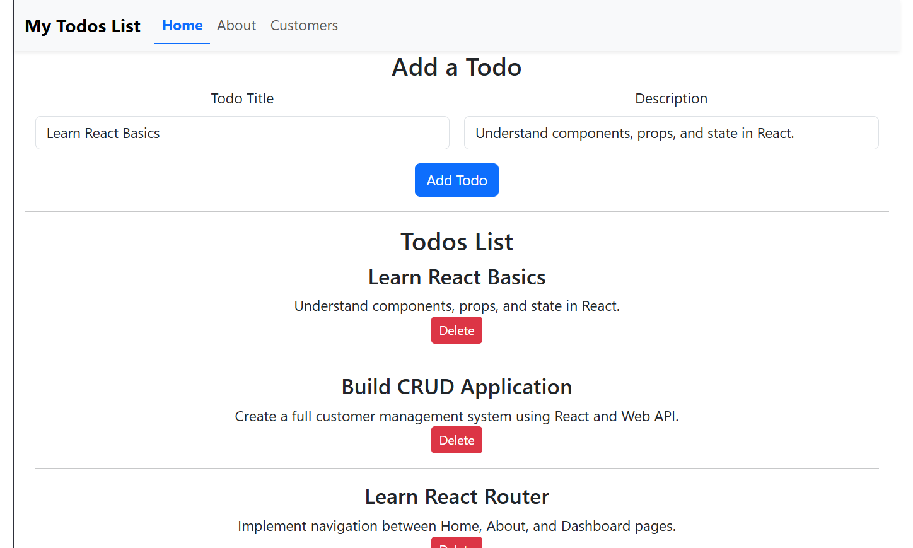
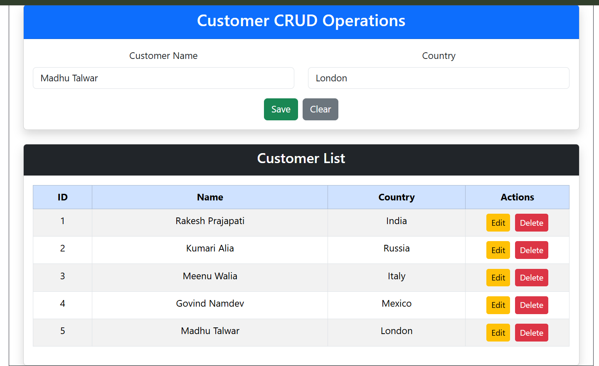

# MyFirstReactApp

## Overview

MyFirstReactApp is a React-based web application developed to practice React concepts and API integration. The application includes a Todo List module and Customer CRUD operations using Axios to communicate with an ASP.NET Web API backend.

## Features

### Todo List

* Add new tasks
* View all tasks
* Delete tasks
* Manage daily activities

### Customer CRUD Operations

* Create customer records
* View customer details
* Update customer information
* Delete customer records
* Fetch data from Web API using Axios

## Technologies Used

### Frontend

* React JS
* JavaScript
* HTML5
* CSS3
* Axios

### Backend

* ASP.NET Web API
* C#

### Database

* SQL Server

## Installation

### Clone Repository

```bash
git clone <https://github.com/RakeshPrajapati123>
```

### Install Dependencies

```bash
npm install
```

### Run Application

```bash
npm run dev
```

## 📸 Screenshots

### Todo List


### Customer List


## Learning Objectives

This project was created to learn:

* React Components
* React Hooks
* State Management
* Event Handling
* Axios API Calls
* CRUD Operations
* Web API Integration

## Future Enhancements

* User Authentication
* Search Functionality
* Form Validation
* Responsive Design
* Pagination

## Author

Rakesh Prajapati

Full Stack Developer
